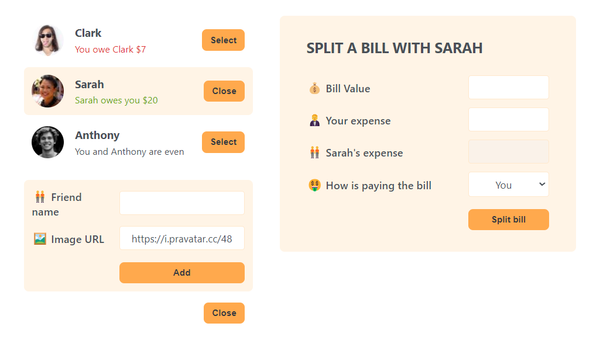

This is a project that is taught by [Jonas Schmedtmann](https://github.com/jonasschmedtmann) in his awesome [Course](https://www.udemy.com/course/the-ultimate-react-course/?couponCode=ST13MT40224)

in this project, I learned:

- how to use **useState**

- how to use **Controlled Elements**

- how to **conditionally render components**

  
